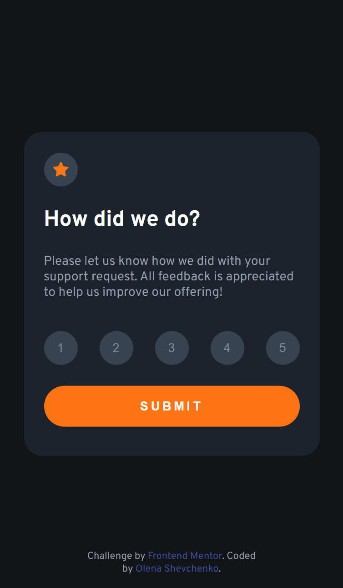
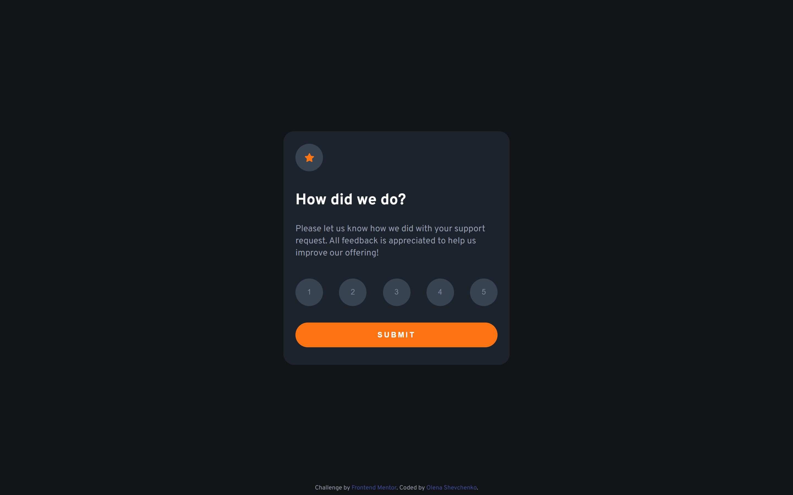

# Frontend Mentor - Interactive rating component solution

This is a solution to the [Interactive rating component challenge on Frontend Mentor](https://www.frontendmentor.io/challenges/interactive-rating-component-koxpeBUmI). Frontend Mentor challenges help you improve your coding skills by building realistic projects. 

## Table of contents
  - [The challenge](#the-challenge)
  - [Screenshot](#screenshot)
  - [Links](#links)
  - [Built with](#built-with)
  - [What I learned](#what-i-learned)
  - [Continued development](#continued-development)
- [Author](#author)

### The challenge

Users should be able to:

- View the optimal layout for the app depending on their device's screen size
- See hover states for all interactive elements on the page
- Select and submit a number rating
- See the "Thank you" card state after submitting a rating

### Screenshot

### Links

- Solution URL: https://github.com/olenahelena/interactive_components 
- Live Site URL: [Add live site URL here](https://your-live-site-url.com)

### Built with

- Semantic HTML5 markup
- SCSS
- Flexbox
- Mobile-first workflow
- JavaScript

### What I learned

I have learned more about flexboxes and about creating JavaScript functions. I had more practice with icons and with pictures. 

### Continued development

I have to work more on JavaScript functions.

## Author

- Website - [Add your name here](https://github.com/olenahelena/interactive_components)
- Frontend Mentor - [@olenahelena](https://www.frontendmentor.io/profile/olenahelena)